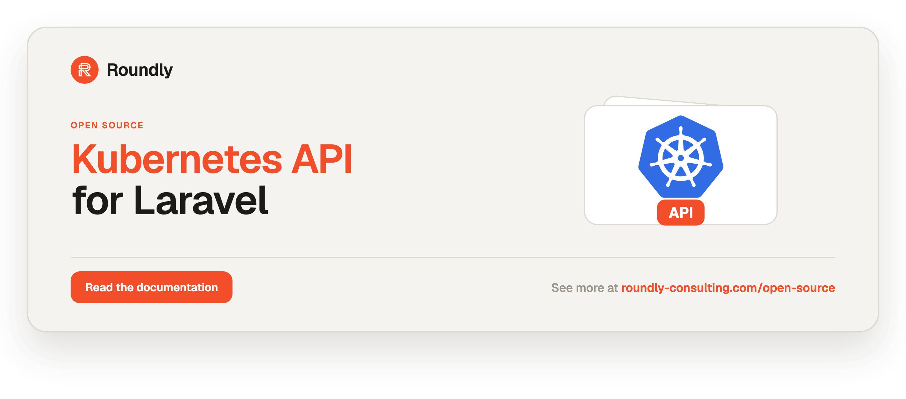

<!-- roundly-hero:start -->
<p align="center">
  <a href="https://roundly-consulting.com/open-source/docs/kubernetes-api-for-laravel?utm_source=github&utm_medium=readme&utm_campaign=open-source&utm_content=kubernetes-api-for-laravel">
    
  </a>
</p>
<!-- roundly-hero:end -->

<!-- roundly-badges:start -->
<p align="center">
  <a href="https://packagist.org/packages/roundly-consulting/kubernetes-api-for-laravel"></a>
  <a href="https://github.com/roundly-consulting/kubernetes-api-for-laravel/actions/workflows/run-tests.yml"></a>
  <a href="https://github.com/roundly-consulting/kubernetes-api-for-laravel/actions/workflows/fix-php-code-style-issues.yml"></a>
  <a href="https://donate.stripe.com/dRmeVe8FX5PF1Qd9pXcEw00"></a>
  <a href="https://www.patreon.com/cw/roundly"></a>
  <a href="https://roundly-consulting.com/support-us?utm_source=github&utm_medium=readme&utm_campaign=open-source&utm_content=kubernetes-api-for-laravel#crypto"></a>
</p>
<!-- roundly-badges:end -->

# Kubernetes API for Laravel

A fluent, Eloquent-style client for the Kubernetes API in Laravel. Talk to one or many
clusters with an expressive, chainable API built on top of Laravel's HTTP client, with
first-class support for the core Kubernetes resources, Traefik CRDs, and your own custom
resource definitions.

```php
use RoundlyConsulting\KubernetesApi\Facades\Kubernetes;

$pods = Kubernetes::namespace('shop')->pods()->whereLabel('app', 'web')->get();

$deployments = Kubernetes::cluster('production')->deployments()->get();
```

## Requirements

- PHP 8.4 or higher
- Laravel 12 or 13

## Integrates with

This package builds on three sibling roundly-consulting packages, all hard requirements
(wired by path locally and VCS on CI until they land on Packagist):

- **[`roundly-consulting/enums-for-laravel`](https://github.com/roundly-consulting/enums-for-laravel)** —
  powers the richer `PatchType` enum. Beyond `PatchType::StrategicMerge->contentType()` you now get
  `PatchType::values()`, `PatchType::validationRule()`, `PatchType::options()`/`toOptions()`, clean
  `readable()`/`label()` names ("Strategic Merge", "Merge", "Json", "Apply"), and case lookups
  (`fromName()`, `fromLabel()`).
- **[`roundly-consulting/http-client-rate-limits-for-laravel`](https://github.com/roundly-consulting/http-client-rate-limits-for-laravel)** —
  paces every apiserver request per cluster, honours a `429 Retry-After`, and offers a fail-fast
  ceiling. See [Client-side rate limiting](#client-side-rate-limiting).
- **[`roundly-consulting/package-toolkit-for-laravel`](https://github.com/roundly-consulting/package-toolkit-for-laravel)** —
  bootstraps the service provider (config merge/publish, commands) and adds a `php artisan about`
  section for the package. Its `HasRetryAfter` contract is what `RateLimitExceededException`
  implements, so a host can render a `Retry-After` header from any roundly rate-limit failure
  without knowing which package threw it.

## Installation

Install the package via Composer:

```bash
composer require roundly-consulting/kubernetes-api-for-laravel
```

Optionally publish the config file:

```bash
php artisan vendor:publish --tag="kubernetes-config"
```

Every resource listed in the published config is registered automatically by the package's
service provider, so custom resources you add there are available immediately.

## Configuration

The published `config/kubernetes.php` looks like this:

```php
use RoundlyConsulting\KubernetesApi\Resources;

return [
    'default' => env('KUBERNETES_CLUSTER', 'default'),
    'clusters' => [
        'default' => [
            'source' => env('KUBERNETES_SOURCE', 'url'),      // url | kubeconfig | in-cluster
            'url' => env('KUBERNETES_URL'),
            'token' => env('KUBERNETES_TOKEN'),
            'certificate' => env('KUBERNETES_CLIENT_CERTIFICATE'),
            'private_key' => env('KUBERNETES_CLIENT_KEY'),
            'ca_certificate' => env('KUBERNETES_CA_CERTIFICATE'),
            'verify' => env('KUBERNETES_VERIFY_SSL', true),
            'kubeconfig' => env('KUBERNETES_KUBECONFIG'),     // null = KUBECONFIG or ~/.kube/config
            'context' => env('KUBERNETES_CONTEXT'),           // null = current-context
            'namespace' => env('KUBERNETES_NAMESPACE', 'default'),
            'manager' => env('KUBERNETES_MANAGER'),
        ],
    ],
    'client' => [
        'options' => [
            'timeout' => 5,
        ],
        'stream_timeout' => env('KUBERNETES_STREAM_TIMEOUT', 0),
    ],
    'rate_limits' => [
        'enabled' => env('KUBERNETES_RATELIMIT_ENABLED', true),
        'owner' => env('KUBERNETES_RATELIMIT_OWNER', 'app'),
        'max_attempts' => env('KUBERNETES_RATELIMIT', 400),
        'timespan' => env('KUBERNETES_RATELIMIT_TIMESPAN', 'minute'),
        'adaptive' => env('KUBERNETES_RATELIMIT_ADAPTIVE', true),
        'max_wait' => env('KUBERNETES_RATELIMIT_MAX_WAIT'),
        'jitter' => env('KUBERNETES_RATELIMIT_JITTER'),
    ],
    'traefik' => [
        'group' => 'traefik.io/v1alpha1',
    ],
    'resources' => [
        'clusterRoles' => Resources\ClusterRole::class,
        'clusterRoleBindings' => Resources\ClusterRoleBinding::class,
        'configMaps' => Resources\ConfigMap::class,
        'cronJobs' => Resources\CronJob::class,
        'daemonSets' => Resources\DaemonSet::class,
        'deployments' => Resources\Deployment::class,
        'endpoints' => Resources\Endpoints::class,
        'events' => Resources\Event::class,
        'horizontalPodAutoscalers' => Resources\HorizontalPodAutoscaler::class,
        'ingresses' => Resources\Ingress::class,
        'jobs' => Resources\Job::class,
        'limitRanges' => Resources\LimitRange::class,
        'namespaces' => Resources\KubernetesNamespace::class,
        'networkPolicies' => Resources\NetworkPolicy::class,
        'nodes' => Resources\Node::class,
        'persistentVolumes' => Resources\PersistentVolume::class,
        'persistentVolumeClaims' => Resources\PersistentVolumeClaim::class,
        'pods' => Resources\Pod::class,
        'replicaSets' => Resources\ReplicaSet::class,
        'replicationControllers' => Resources\ReplicationController::class,
        'resourceQuotas' => Resources\ResourceQuota::class,
        'roles' => Resources\Role::class,
        'roleBindings' => Resources\RoleBinding::class,
        'secrets' => Resources\Secret::class,
        'serviceAccounts' => Resources\ServiceAccount::class,
        'services' => Resources\Service::class,
        'statefulSets' => Resources\StatefulSet::class,
        'storageClasses' => Resources\StorageClass::class,
        'traefikIngressRoutes' => Resources\TraefikIngressRoute::class,
        'traefikMiddlewares' => Resources\TraefikMiddleware::class,
        'traefikServersTransports' => Resources\TraefikServersTransport::class,
        'traefikTlsOptions' => Resources\TraefikTlsOption::class,
        'traefikTlsStores' => Resources\TraefikTlsStore::class,
    ],
];
```

| Key | Type | Default | Purpose |
|---|---|---|---|
| `default` | `string` | `default` (`KUBERNETES_CLUSTER`) | The cluster `Kubernetes::pods()`, `Kubernetes::ping()` and every other default-cluster shortcut use, and what `kubernetes:ping` checks without an argument. |
| `clusters.<name>.source` | `string` | `url` (`KUBERNETES_SOURCE`) | Where the connection comes from: `url` (the keys below), `kubeconfig` (a kubeconfig file and context) or `in-cluster` (the pod's service account). |
| `clusters.<name>.url` | `string\|null` | `null` (`KUBERNETES_URL`) | The apiserver URL for the `url` source. |
| `clusters.<name>.token` | `string\|null` | `null` (`KUBERNETES_TOKEN`) | Bearer token. |
| `clusters.<name>.certificate` / `private_key` / `ca_certificate` | `string\|null` | `null` | Paths to the client certificate, its key and the CA bundle. |
| `clusters.<name>.verify` | `bool` | `true` (`KUBERNETES_VERIFY_SSL`) | TLS verification. Only turn off for local development. |
| `clusters.<name>.kubeconfig` / `context` | `string\|null` | `null` | For the `kubeconfig` source: the file (null = `KUBECONFIG` or `~/.kube/config`) and context (null = `current-context`). |
| `clusters.<name>.namespace` | `string` | `default` (`KUBERNETES_NAMESPACE`) | The default namespace for namespaced resources on this cluster. |
| `clusters.<name>.manager` | `string\|null` | `null` (`KUBERNETES_MANAGER`) | Your app's field manager, sent as `fieldManager` on every write and as the user agent. A server-side apply without one uses `kubernetes-api-for-laravel`. It does not key the rate-limit budget (that is per apiserver). |
| `client.options` | `array<string, mixed>` | `['timeout' => 5]` | Laravel HTTP client options merged into every request the package sends (timeout, proxy, etc.). The `timeout` (seconds, int, float or a numeric string; `0` = none) bounds ordinary requests. For watches and `streamLogs()` it bounds only connecting and the response headers; `exec()` ignores it. |
| `client.stream_timeout` | `int` (seconds, 0–86400) | `0` (`KUBERNETES_STREAM_TIMEOUT`) | Idle timeout for streams: after this many seconds of silence a watch or log follow ends cleanly, and an unfinished `exec()` reports no exit code. `0` waits indefinitely, like kubectl. The apiserver still closes a watch after its own timeout. |
| `rate_limits.enabled` | `bool` | `true` (`KUBERNETES_RATELIMIT_ENABLED`) | Toggle client-side rate limiting. `false` sends raw, unthrottled requests. |
| `rate_limits.owner` | `string` | `app` (`KUBERNETES_RATELIMIT_OWNER`) | Namespaces the budget key, so several apps/workers can share (or isolate) a cluster budget. |
| `rate_limits.max_attempts` | `int` (≥ 1) | `400` (`KUBERNETES_RATELIMIT`) | Requests allowed per cluster per window before pacing kicks in. |
| `rate_limits.timespan` | `string` | `minute` (`KUBERNETES_RATELIMIT_TIMESPAN`) | Window length: `second`, `minute`, `hour`, or `day`. |
| `rate_limits.adaptive` | `bool` | `true` (`KUBERNETES_RATELIMIT_ADAPTIVE`) | Honour the apiserver's `Retry-After` header on a `429`, self-tuning the limiter. |
| `rate_limits.max_wait` | `int\|null` (ms, ≥ 0) | `null` (`KUBERNETES_RATELIMIT_MAX_WAIT`) | `null` paces (waits). Set a ceiling in ms to fail fast with a `RateLimitExceededException` instead. |
| `rate_limits.jitter` | `int\|null` (ms, ≥ 0) | `null` (`KUBERNETES_RATELIMIT_JITTER`) | Random spread added to each defer, smoothing thundering-herd bursts. |
| `traefik.group` | `string` | `traefik.io/v1alpha1` | The API group/version the bundled Traefik resources target. Set it to `traefik.containo.us/v1alpha1` for Traefik installations older than v3. |
| `resources` | `array<string, class-string>` | the core, workload, RBAC, policy + Traefik resources above | Maps an accessor name (e.g. `deployments`) to the resource class that backs it (`$cluster->deployments()`). Point a name at your own subclass to swap it, or add your own CRDs here to register them globally. |

The `bool` switches (`clusters.<name>.verify`, `rate_limits.enabled`, `rate_limits.adaptive`)
accept `true`/`false`, `1`/`0`, `on`/`off` and `yes`/`no`. Any other value throws naming the key
(a `ClusterConfigurationException` for `verify`, an `InvalidConfigurationException` for the rate
limits), so a typo in `KUBERNETES_VERIFY_SSL` can never switch TLS verification off.

Every other key is read just as strictly. Nothing falls back to a default except a key that is
not set. **Blank means not set:** an absent key, `null` and a blank value (a host's `KEY=`, empty
or whitespace only) all take the default — on the switches too, where a blank is never false:

- **Numbers** take an int or an integer string (`'400'`): `rate_limits.max_attempts` (≥ 1),
  `rate_limits.max_wait` / `jitter` (≥ 0) and `client.stream_timeout` (0–86400).
  `client.options.timeout` also takes a float or decimal string (`'2.5'`), 0 or more. `'five'`,
  `'5.5'` for an integer, `'5s'` or a negative number throws.
- **`rate_limits.timespan`** must be exactly `second`, `minute`, `hour` or `day`. A typo such as
  `minutes` throws instead of becoming a minute.
- **Strings** (`default`, the `clusters.<name>` URL, credential paths, `kubeconfig`, `context`,
  `namespace` and `manager`, plus `rate_limits.owner` and `traefik.group`) must be strings. A
  blank env such as `KUBERNETES_TOKEN=` is not set: no token is sent, exactly as if the line were
  missing. An unknown or non-string `source` throws; a blank one is `url`.
- **Maps.** `clusters`, a `clusters.<name>` entry, `client.options` and `resources` must be
  arrays, and every `resources` entry must name a `Resource` subclass.

Cluster and client settings throw `ClusterConfigurationException`, `resources` throws
`InvalidResourceException`, and the rate limits and `traefik.group` throw the toolkit's
`InvalidConfigurationException`. Each message names the key.

The built-in accessors cover config maps, secrets, pods, deployments, replica sets, stateful
sets, daemon sets, replication controllers, jobs, cron jobs, services, endpoints, ingresses,
namespaces, nodes, events, persistent volumes and claims, storage classes, RBAC
(roles/role bindings/cluster roles/cluster role bindings/service accounts), network policies,
horizontal pod autoscalers, resource quotas, limit ranges, and the Traefik CRDs
(`IngressRoute`, `Middleware`, `TLSStore`, `ServersTransport`, `TLSOption`).

The package works with zero configuration: set `KUBERNETES_URL` and `KUBERNETES_TOKEN` for a
single cluster, add more under `clusters`, or define clusters in code (see below). The default
`resources` map ships built in. The Namespace resource class is `Resources\KubernetesNamespace`
(`Namespace` is a reserved word in PHP); its accessor is still `namespaces()`.

## Usage

Everything starts at the `Kubernetes` facade. It hands out **clusters** (immutable clients)
and, through them, **resource objects** (`Pod`, `Deployment`, …) that read and write the
apiserver. Calls without a cluster name go to the default cluster from `config/kubernetes.php`.

```php
use RoundlyConsulting\KubernetesApi\Facades\Kubernetes;

Kubernetes::pods()->get();                                   // default cluster, default namespace
Kubernetes::namespace('shop')->deployments()->get();         // default cluster, scoped to `shop`
Kubernetes::cluster('production')->services()->get();        // a named cluster

Kubernetes::ping();                                          // bool — does the apiserver answer?
Kubernetes::version()->gitVersion;                           // "v1.34.0" (a VersionInfo DTO)

Kubernetes::hasCluster('production');                        // bool
Kubernetes::clusters();                                      // ['default', 'production']
```

### Facade reference

| Method | Returns | What it does |
|---|---|---|
| `cluster(?string $name = null)` | `Cluster` | A configured or registered cluster (the default one when `null`). Resolved once and reused. |
| `hasCluster(string $name)` / `clusters()` | `bool` / `list<string>` | Whether a cluster exists; every configured and registered name. |
| `registerCluster(string $name, Closure $definition)` | `void` | Define a cluster in code; overrides a configured one of the same name. |
| `registerResource(string $name, string $class)` | `void` | Register a resource class under an accessor name for every cluster. |
| `namespace(string $namespace)` | `Cluster` | The default cluster, scoped to one namespace. |
| `ping()` / `version()` | `bool` / `VersionInfo` | Health and build information of the default cluster. |
| `url(string $url)` | `Cluster` | A new, blank ad-hoc cluster. |
| `connect(KubeConfig $config)` | `Cluster` | A new ad-hoc cluster from a resolved connection. |
| `fromKubeConfig(?string $path, ?string $context)` / `inCluster()` | `Cluster` | A new ad-hoc cluster from a kubeconfig context or the pod's service account. |
| `resource(string $class)` | `Resource` | Any resource class, bound to the default cluster. |
| `pods()`, `deployments()`, `services()`, … (33 accessors) | the resource | Every packaged resource, bound to the default cluster. |
| `fake()` | `KubernetesFake` | Swap in the in-memory apiserver for tests (see [Testing your app](#testing-your-app)). |

Every `Cluster` has the same accessors plus `name()`, `namespace()`, `ping()`, `version()`,
`resource()`, the credential getters (`getUrl()`, `getToken()`, …) and a raw
`request($method, $path, $query, $body)` escape hatch that is authenticated, rate limited and
faked like everything else.

### Without the facade

The facade is sugar over `RoundlyConsulting\KubernetesApi\KubernetesManager`, a container
singleton. Inject it for the same API:

```php
use RoundlyConsulting\KubernetesApi\DataTransferObjects\Scale;
use RoundlyConsulting\KubernetesApi\KubernetesManager;

final class ScaleCheckout
{
    public function __construct(private KubernetesManager $kubernetes) {}

    public function __invoke(int $replicas): Scale
    {
        return $this->kubernetes->cluster('production')
            ->deployments()
            ->setName('checkout')
            ->scale($replicas);
    }
}
```

This package is a remote-API client, so there are no action classes: the use cases are the
resource objects themselves. You can build one directly and bind it to a cluster from the
manager — it goes through the same transport (and the same fake):

```php
use RoundlyConsulting\KubernetesApi\Resources\ConfigMap;

ConfigMap::make()
    ->setCluster($kubernetes->cluster('production'))
    ->setNamespace('shop')
    ->setName('settings')
    ->setData(['FEATURE_X' => 'on'])
    ->create();
```

### Clusters are immutable

`url()`, every `with*()` / `without*()`, `withManagerName()`, `withDefaultNamespace()` and
`namespace()` return a **new** cluster and leave the one you called untouched. A client handed
out by the facade can never be re-pointed or re-credentialed by another caller.

```php
$cluster = Kubernetes::url('https://api.my-cluster.example:6443')
    ->withToken('service-account-token')
    ->withCertificate('/path/to/client.crt')
    ->withPrivateKey('/path/to/client.key')
    ->withCaCertificate('/path/to/ca.crt')
    ->withSslVerification()
    ->withManagerName('my-app'); // the field manager on resources this app writes

$cluster->withToken('other');   // returns a copy — $cluster still uses 'service-account-token'
```

The manager name is sent as the `fieldManager` query parameter on every create, update, patch,
scale and rollout restart, so `managedFields` records your app as the owner of what it wrote. It
is also sent as the `User-Agent`. A server-side apply needs a field manager, so without a manager
name it falls back to `kubernetes-api-for-laravel`.

`Kubernetes::url()` starts from a blank client: it inherits nothing — no token, no
certificate — from the default cluster. For local development you can skip the certificates
and disable verification (not recommended for production):

```php
$cluster = Kubernetes::url('https://127.0.0.1:6443')
    ->withToken('token')
    ->withoutSslVerification();
```

### From a kubeconfig or in-cluster

Point the client at a cluster in one line instead of hand-wiring the URL and credentials.
`fromKubeConfig()` parses the kubeconfig, resolves the named context's cluster and user, and
materialises any inline certificate data to private temp files (one per distinct PEM, removed
when the PHP process exits). Relative certificate paths (`certificate-authority: certs/ca.crt`)
resolve against the kubeconfig's own directory, as kubectl does. A cluster's
`insecure-skip-tls-verify` must be a boolean (`true`/`false`, also `yes`/`no`, `on`/`off`,
`1`/`0`, quoted or not); anything else throws `KubeConfigException` instead of guessing, so a
quoted `"false"` keeps TLS verification on.

`inCluster()` reads the service-account token and CA mounted into a pod, and the
`KUBERNETES_SERVICE_HOST`/`KUBERNETES_SERVICE_PORT` env (IPv6 hosts included). TLS verification
stays on: if the CA file is missing it throws `KubeConfigException` rather than send the token to
an unverified apiserver.

```php
use RoundlyConsulting\KubernetesApi\Facades\Kubernetes;

// Current context from the default kubeconfig (or the KUBECONFIG env path):
$cluster = Kubernetes::fromKubeConfig();

// A specific context, optionally from an explicit kubeconfig path:
$cluster = Kubernetes::fromKubeConfig(context: 'orbstack');
$cluster = Kubernetes::fromKubeConfig(path: '/path/to/kubeconfig', context: 'staging');

// From in-cluster service-account mounts (when running inside a pod):
$cluster = Kubernetes::inCluster()->withManagerName('my-app');
```

The same sources work from config — `'source' => 'kubeconfig'` or `'source' => 'in-cluster'`
on a `clusters` entry.

### Registering named clusters

Configure clusters under `clusters` in `config/kubernetes.php`, or register them in code (for
example in a service provider's `boot` method). The closure receives a blank cluster and must
**return** the configured one; it runs lazily, the first time the cluster is used.

```php
use RoundlyConsulting\KubernetesApi\Cluster;
use RoundlyConsulting\KubernetesApi\Facades\Kubernetes;

Kubernetes::registerCluster('production', fn (Cluster $cluster): Cluster => $cluster
    ->url('https://api.prod.example:6443')
    ->withToken(config('services.kubernetes.production_token'))
    ->withCaCertificate('/path/to/ca.crt'));

$cluster = Kubernetes::cluster('production');
```

An unknown name throws `ClusterNotFoundException`; a closure that returns anything but a
`Cluster` throws `ClusterConfigurationException`.

### Scoping to a namespace

`namespace()` scopes a cluster to one namespace. Everything it hands out is pinned there:
every request goes to that namespace, and any attempt to leave it — `setNamespace('other')`,
`allNamespaces()`, `ignoreNamespace()`, re-scoping the cluster, binding the resource to a cluster
scoped elsewhere — throws `NamespaceScopeException`. Items a scoped listing returns stay pinned
too. Cluster-scoped kinds (nodes, namespaces, cluster roles, …) are unaffected.

```php
$shop = Kubernetes::namespace('shop');           // or Kubernetes::cluster('production')->namespace('shop')

$shop->pods()->whereLabel('app', 'web')->get();  // GET /api/v1/namespaces/shop/pods?labelSelector=app%3Dweb
$shop->pods()->setNamespace('kube-system');      // NamespaceScopeException
```

A `namespace` on a `clusters` entry (or `withDefaultNamespace()`) is only a default; `namespace()`
is the boundary.

Names can't get around it either. Before a request is sent, every value that goes into the URL
path is checked:

- **Names** must be a single path segment: not `.` or `..`, and no `/`, `%` or whitespace. They
  are also percent-encoded.
- **Namespaces** must be valid DNS-1123 labels.
- **Plurals and apiVersions** must match their Kubernetes grammar.

Anything else throws `InvalidResourceException` and nothing is sent. So
`withName('../../kube-system/secrets/admin-token')` can't leave `shop`. The raw
`request($method, $path)` escape hatch is the exception: it sends the path you give it exactly as
written and is not scoped.

### Registering custom resources (CRDs)

Define a resource class and register it either in `config/kubernetes.php` or at runtime:

```php
use RoundlyConsulting\KubernetesApi\Facades\Kubernetes;
use RoundlyConsulting\KubernetesApi\Resources\Resource;

class Application extends Resource
{
    protected string $version = 'example.com/v2';

    protected string $kind = 'Application';

    protected bool $usesNamespaces = true;
}

Kubernetes::registerResource('apps', Application::class);

Kubernetes::cluster('production')->apps()->get(); // all Application resources
Kubernetes::apps()->get();                        // on the default cluster
```

Registering a packaged name (`pods`) swaps the class that name resolves to on every cluster. A
name a `Cluster` method already answers (`url`, `namespace`, …) is refused.

### Cluster operations

Operations use Laravel's HTTP client. In your tests, prefer `Kubernetes::fake()` (see
[Testing your app](#testing-your-app)); `Http::fake()` still works too.

```php
use RoundlyConsulting\KubernetesApi\Resources\Pod;
use RoundlyConsulting\KubernetesApi\Resources\Types\Container;

$cluster = Kubernetes::cluster('production');

// List every deployment — returns a ResourcesCollection of Deployment resources.
$cluster->deployments()->get();

// Find a single deployment — returns a Deployment resource.
$cluster->deployments()->withName('checkout')->find();

// Check existence — returns a boolean.
$cluster->deployments()->withName('checkout')->existsOnCluster();

// Create a deployment. The apiserver requires a pod selector and a pod template whose
// labels match it.
$template = Pod::make()
    ->setLabels(['app' => 'checkout'])
    ->setContainers([Container::make()->setName('app')->setImage('nginx', '1.27-alpine')]);

$deployment = $cluster->deployments()
    ->setName('checkout')
    ->setReplicas(3)
    ->setPodsSelectors(['app' => 'checkout'])
    ->setTemplate($template)
    ->create();

$deployment->wasRecentlyCreated(); // true
$deployment->exists();             // true

// Update a deployment.
$cluster->deployments()
    ->withName('checkout')
    ->find()
    ->setReplicas(5)
    ->update();

// Update if it exists, otherwise create it. The update replaces the whole object, so send
// the full manifest, not just the fields you change.
$cluster->deployments()
    ->setName('checkout')
    ->setReplicas(2)
    ->setPodsSelectors(['app' => 'checkout'])
    ->setTemplate($template)
    ->updateOrCreate();

// Delete a deployment.
$deleted = $cluster->deployments()->withName('checkout')->delete();
$deleted->exists(); // false
```

`updateOrCreate()` carries the server's current `resourceVersion` into the update so a
concurrent change surfaces as a typed 409 conflict instead of being silently clobbered.

### Listing with selectors and pagination

Push filtering to the apiserver with label/field selectors, and paginate large lists instead
of fetching everything at once:

```php
// Label and field selectors build the labelSelector / fieldSelector query params.
$pods = $cluster->pods()
    ->whereLabel('app', 'checkout')
    ->whereLabelIn('tier', ['web', 'api'])
    ->whereLabelExists('team')
    ->whereField('status.phase', 'Running')
    ->limit(100)
    ->get();

// List across every namespace.
$all = $cluster->pods()->allNamespaces()->get();

// Page explicitly with a continue token.
$page = $cluster->pods()->limit(50)->getPage();
$page->items;               // ResourcesCollection
$page->continue;            // ?string — pass to ->continueFrom(...) for the next page
$page->remainingItemCount;  // ?int

// Or iterate every item lazily, auto-following continue tokens.
$cluster->pods()->each(function ($pod): void {
    // ...
});
```

### Patch, scale, rollout, and dry-run

```php
use RoundlyConsulting\KubernetesApi\DataTransferObjects\KubernetesPatch;

// Targeted patches (strategic-merge / merge / JSON Patch).
$cluster->deployments()->withName('checkout')
    ->patch(KubernetesPatch::merge(['spec' => ['paused' => true]]));

// Server-side apply: sent with your manager name as fieldManager. force: true takes over
// fields another manager owns instead of failing with a 409 conflict.
$cluster->deployments()->withName('checkout')
    ->patch(KubernetesPatch::apply([
        'apiVersion' => 'apps/v1',
        'kind' => 'Deployment',
        'metadata' => ['name' => 'checkout'],
        'spec' => ['replicas' => 3],
    ], force: true));

// Scale via the /scale subresource. Returns the apiserver's Scale answer (a DTO), not the
// Deployment: $scale->replicas (desired), ->currentReplicas (observed), ->selector.
$scale = $cluster->deployments()->withName('checkout')->scale(5);

// Roll the pods by stamping the restartedAt annotation (like `kubectl rollout restart`).
$cluster->deployments()->withName('checkout')->rolloutRestart();

// Validate a write without persisting it by appending ?dryRun=All.
$cluster->deployments()->withName('checkout')->dryRun()->scale(5);
```

`scale()` is available on deployments, replica sets, stateful sets, and replication
controllers; `rolloutRestart()` on deployments, stateful sets, and daemon sets.

### Watching for changes

```php
use RoundlyConsulting\KubernetesApi\DataTransferObjects\WatchEvent;

$cluster->pods()->whereLabel('app', 'checkout')->watch(function (WatchEvent $event): void {
    $event->type;           // ADDED / MODIFIED / DELETED
    $event->object;         // the Pod resource
});
```

Each event reaches the callback as soon as the apiserver sends it. `watch()` returns when the
stream ends. That happens when the apiserver closes the watch (it does so on its own timeout,
usually after 30–60 minutes), or after `client.stream_timeout` seconds of silence if you set one.
The request `timeout` in `client.options` only bounds connecting and the response headers. A
connection that breaks off mid-stream throws Laravel's `ConnectionException`. Long-lived watches
suit queued or console contexts, not web requests. Re-open the watch in a loop if you need it to
run forever.

### Pod logs and exec

```php
use RoundlyConsulting\KubernetesApi\DataTransferObjects\PodLogOptions;

// Fetch logs as a string.
$logs = $cluster->pods()->withName('api')->logs(
    new PodLogOptions(container: 'app', tailLines: 200, timestamps: true),
);

// Stream logs line by line (tail). With follow: true it runs until the container stops
// (or client.stream_timeout seconds pass with no output), not the request timeout.
foreach ($cluster->pods()->withName('api')->streamLogs(new PodLogOptions(follow: true)) as $line) {
    echo $line . PHP_EOL;
}

// Exec a command inside a pod (over a WebSocket; returns stdout, stderr, and exit code).
$result = $cluster->pods()->withName('api')->exec(['sh', '-c', 'echo hi']);
$result->stdout;       // "hi\n"
$result->exitCode;     // 0 (null if the stream ended before the command finished)
$result->successful(); // true only for exit code 0
$result->completed();  // false if the connection dropped or client.stream_timeout passed
```

`exec()` dials the cluster URL's own scheme, host, port and path prefix, so a proxied apiserver
(`https://rancher.example/k8s/clusters/c-abc`) works just like a direct one. It waits for the
apiserver to report the command's exit status. If the stream ends first, the result has no exit
code and `successful()` is `false`, never a false success.

### Diagnostics command

Verify connectivity to a cluster (the default one when no name is given):

```bash
php artisan kubernetes:ping production
# Connected to production — server v1.34.0
```

In code, `Kubernetes::ping()` / `Kubernetes::cluster('production')->ping()` return a bool and
`version()` returns a `VersionInfo` DTO (`major`, `minor`, `gitVersion`, `gitCommit`,
`buildDate`, `goVersion`, `compiler`, `platform`).

### Building resources with value objects

Resources compose from typed value objects such as `Container`, `Port`, `Probe`, `Volume`,
and `VolumeMount`:

```php
use RoundlyConsulting\KubernetesApi\Resources\Pod;
use RoundlyConsulting\KubernetesApi\Resources\Types\Container;
use RoundlyConsulting\KubernetesApi\Resources\Types\Probe;

$pod = Pod::make()
    ->setName('checkout')
    ->setContainers([
        Container::make()
            ->setName('app')
            ->setImage('registry.example/checkout', 'v1.4.0')
            ->addPort(8080)
            ->setMinimumMemory(256, 'Mi')
            ->setReadinessProbe(Probe::http('/healthz', 8080)),
    ]);
```

### TLS certificate secrets

`Secret` supports a typed `type` plus a TLS convenience that base64-encodes a PEM
certificate and key into a `kubernetes.io/tls` Secret:

```php
use RoundlyConsulting\KubernetesApi\Resources\Secret;

$secret = $cluster->secrets()
    ->setNamespace('default')
    ->setName('wildcard-tls')
    ->asTlsCertificate($pemCertificate, $pemPrivateKey)   // sets type + data['tls.crt'] / data['tls.key']
    ->create();

$secret->getType();              // "kubernetes.io/tls"
$secret->getData('tls.crt');     // the decoded PEM certificate

// Or set an arbitrary Secret type explicitly:
$cluster->secrets()->setName('dockercfg')->setType('kubernetes.io/dockerconfigjson');
```

### Select-all and empty selectors

An empty label selector means "select all" in Kubernetes and must be sent as the empty
object `{}`, not `[]` (which the apiserver rejects). The selector setters handle this for
you — passing an empty array serialises correctly:

```php
use RoundlyConsulting\KubernetesApi\Resources\NetworkPolicy;

// Default-deny / select-all: an empty podSelector matches every pod in the namespace.
$cluster->networkPolicies()
    ->setNamespace('default')
    ->setName('default-deny')
    ->setPodSelector([])           // serialises to "podSelector": {}
    ->setPolicyTypes(['Ingress'])
    ->create();
```

`Service::setSelectors([])` serialises the same way. Workload pod selectors are different: the
apiserver refuses an empty selector on `apps/v1` workloads (`Deployment`, `ReplicaSet`,
`StatefulSet`, `DaemonSet`), so always give them at least one label, as in
`setPodsSelectors(['app' => 'checkout'])`.

### Traefik TLS and transport CRDs

Beyond `IngressRoute` and `Middleware`, the package ships first-class resources for
Traefik's TLS and transport CRDs. Their REST plurals (`tlsstores`, `serverstransports`,
`tlsoptions`) are pinned to match the real CRDs, and they honour the configurable
`kubernetes.traefik.group`:

```php
// Point a default certificate at a kubernetes.io/tls Secret.
$cluster->traefikTlsStores()
    ->setNamespace('default')
    ->setName('default')
    ->setDefaultCertificate('wildcard-tls')
    ->create();

// Configure how Traefik dials a backend.
$cluster->traefikServersTransports()
    ->setNamespace('default')
    ->setName('backend')
    ->setServerName('backend.internal')
    ->insecureSkipVerify()
    ->setRootCAsSecrets(['backend-ca'])
    ->create();

// Constrain TLS versions and cipher suites.
$cluster->traefikTlsOptions()
    ->setNamespace('default')
    ->setName('modern')
    ->setMinVersion('VersionTLS12')
    ->setCipherSuites(['TLS_AES_256_GCM_SHA384'])
    ->create();
```

### Attributes, labels, and annotations

Every resource exposes Eloquent-style helpers for attributes, labels, and annotations:

```php
$service = $cluster->services()->withName('checkout')->find();

$service->getLabels();                       // array<string, string>
$service->setLabel('tier', 'frontend');
$service->getAnnotation('prometheus.io/scrape', 'false');
$service->getClusterDns();                   // checkout.default.svc.cluster.local
```

### Macros and conditionals

Both `Cluster` and every resource use Laravel's `Macroable` and `Conditionable` traits, so you
can extend and branch fluently. A `Cluster` macro is also callable on the facade (for the
default cluster):

```php
use RoundlyConsulting\KubernetesApi\Cluster;
use RoundlyConsulting\KubernetesApi\Resources\Deployment;

Cluster::macro('checkout', fn (): Deployment => $this->deployments()->setName('checkout'));
Kubernetes::checkout()->scale(3);

Deployment::macro('isPaused', fn (): bool => (bool) $this->getSpec('paused', false));

Kubernetes::deployments()
    ->setName('checkout')
    ->find()
    ->when($scaleUp, fn (Deployment $deployment) => $deployment->setReplicas(5))
    ->update();
```

### Error handling

Failed requests throw a `RoundlyConsulting\KubernetesApi\Exceptions\KubernetesException`,
which carries the underlying `Illuminate\Http\Client\Response` so you can inspect the
Kubernetes API error:

```php
use RoundlyConsulting\KubernetesApi\Exceptions\KubernetesException;

try {
    $cluster->deployments()->withName('missing')->find();
} catch (KubernetesException $e) {
    $e->response->status();          // e.g. 404
    $e->response->json('message');   // the Kubernetes error message
}
```

The package's other exceptions, all under `RoundlyConsulting\KubernetesApi\Exceptions`:

| Exception | Thrown when |
|---|---|
| `ClusterNotFoundException` | `cluster($name)` for a name that is neither configured nor registered |
| `ClusterConfigurationException` | a cluster has no URL, a definition closure returns no `Cluster`, a config `source` is unknown, or a resource is used without a cluster |
| `NamespaceScopeException` | a namespace-scoped client or resource is asked to leave its namespace (`->scope` names it) |
| `InvalidResourceException` | `registerResource()` / `seed()` get a class that is not a resource or an unusable name, or a request's name, namespace, plural or apiVersion cannot be a single URL path segment (nothing is sent) |
| `RateLimitExceededException` | the client-side budget is exhausted and `max_wait` is set (see below) |
| `KubeConfigException` | a kubeconfig or the in-cluster credentials cannot be read |
| `WebSocketException` | the exec WebSocket fails |

### Client-side rate limiting

Every apiserver request is paced through
[`roundly-consulting/http-client-rate-limits-for-laravel`](https://github.com/roundly-consulting/http-client-rate-limits-for-laravel),
keyed **per apiserver**: the cluster URL's host, port and path prefix (so each cluster behind a
Rancher-style proxy gets its own budget). One busy cluster never starves another, even when every
client uses the same manager name. Clients of the same apiserver share one budget, whatever their
manager name or credentials. Kubernetes API Priority & Fairness is per-apiserver, so this maps
directly onto how the server enforces its own limits.

By default the client makes up to **400 requests per minute** per cluster and **paces** anything
beyond that (it waits for the window to free up rather than erroring). With `adaptive` on, a `429`
from the apiserver is read for its `Retry-After` value and self-tunes the limiter — so the next
request already backs off by exactly what the server asked for.

Tune it entirely from config/env (see the [Configuration](#configuration) table):

```dotenv
KUBERNETES_RATELIMIT=400            # attempts per window, per cluster
KUBERNETES_RATELIMIT_TIMESPAN=minute
KUBERNETES_RATELIMIT_ADAPTIVE=true  # honour 429 Retry-After
```

**Fail fast instead of waiting.** Set a `max_wait` ceiling (milliseconds). When a request would
have to wait longer than that, it throws
`RoundlyConsulting\KubernetesApi\Exceptions\RateLimitExceededException` instead of blocking. It
exposes `->cluster` (the registered cluster name, or the apiserver host for an ad-hoc client) and,
via the toolkit's `HasRetryAfter` contract, `->retryAfterSeconds()`:

```php
use RoundlyConsulting\KubernetesApi\Exceptions\RateLimitExceededException;

try {
    $cluster->pods()->get();
} catch (RateLimitExceededException $e) {
    report("Cluster {$e->cluster} is throttled; retry in {$e->retryAfterSeconds()}s");
}
```

Because the exception implements `RoundlyConsulting\PackageToolkit\Contracts\HasRetryAfter`, a host
can handle every roundly rate-limit failure in one place:

```php
use RoundlyConsulting\PackageToolkit\Contracts\HasRetryAfter;

if ($e instanceof HasRetryAfter) {
    return response('Too Many Requests', 429, ['Retry-After' => $e->retryAfterSeconds()]);
}
```

**Disable it** entirely with `KUBERNETES_RATELIMIT_ENABLED=false` for the raw, unthrottled client.

**Shared budgets across workers.** The limiter defaults to an in-memory store (per process — ideal
for a single worker or CLI run). For a budget shared across queue workers or servers, point the
underlying package's store at Cache, Redis, or the database via its own
`HTTP_CLIENT_RATE_LIMITS_STORE` setting; this package does not force a store.

## Testing your app

`Kubernetes::fake()` swaps the manager — behind the facade **and** in the container, so injected
`KubernetesManager`s get it too — for an in-memory apiserver. Nothing reaches the network. Every
cluster the manager hands out (named, default, ad-hoc, namespace-scoped) and every resource bound
to one talks to the fake, which records each request.

```php
use RoundlyConsulting\KubernetesApi\Facades\Kubernetes;
use RoundlyConsulting\KubernetesApi\Resources\Deployment;
use RoundlyConsulting\KubernetesApi\Testing\RecordedRequest;

it('scales checkout for the sale', function () {
    $fake = Kubernetes::fake()->seed(Deployment::class, [
        ['metadata' => ['name' => 'checkout', 'namespace' => 'shop'], 'spec' => ['replicas' => 2]],
    ]);

    app(PrepareForSale::class)();   // your code: Kubernetes::namespace('shop')->deployments()->setName('checkout')->scale(10)

    $fake->assertScaled(Deployment::class, 'checkout', 10);
    $fake->assertNothingDeleted();
});
```

The fake behaves like a small apiserver: seeded and created objects can be listed (label and
field selectors, `limit`/`continue`, all namespaces), found, updated, patched, scaled and
deleted; a missing object is a real 404, a duplicate create or a stale `resourceVersion` a real
409, and `dryRun()` requests validate without persisting. Each cluster name has its own store;
ad-hoc clusters share the default cluster's.

| Set-up | Effect |
|---|---|
| `seed(string $resource, array $items, ?string $cluster = null)` | Put objects (manifests or resource objects) on a cluster. `$resource` is a class or a registered name (`'pods'`). |
| `seedLogs(string $pod, string $logs, string $namespace = 'default', ?string $cluster = null)` | What `logs()` / `streamLogs()` return. |
| `stubExec(ExecResult\|Closure $result)` | What `exec()` returns (default: empty output, exit code 0). |
| `stubVersion(VersionInfo\|string $version)` | What `version()` reports (default `v1.34.0`). |
| `unreachable(bool $unreachable = true)` | Every request throws `ConnectionException`; `ping()` returns `false`. |
| `recorded(?Closure $filter = null)` | Every `RecordedRequest` (verb, cluster, path, namespace, name, body, …). |

| Assertion | Passes when |
|---|---|
| `assertSent(Closure $callback)` / `assertNothingSent()` | any request matches / no request at all |
| `assertCreated($resource, $nameOrClosure = null)` / `assertNothingCreated()` | a create of that resource (optionally that name, or matching the closure) |
| `assertUpdated(…)` / `assertNothingUpdated()` | a full update (`update()`, `updateOrCreate()` on an existing object) |
| `assertPatched(…)` / `assertNothingPatched()` | any PATCH — `patch()`, `scale()`, `rolloutRestart()` |
| `assertScaled($resource, $name, ?int $replicas = null)` / `assertNothingScaled()` | a `scale()` (to that many replicas) |
| `assertRestarted($resource, $name)` / `assertNothingRestarted()` | a `rolloutRestart()` |
| `assertDeleted(…)` / `assertNothingDeleted()` | a delete |
| `assertExecuted(string $pod, ?array $command = null)` / `assertNothingExecuted()` | an `exec()` in that pod (with that exact command) |

Dry-run requests are recorded but never satisfy the mutation assertions. Closures receive the
`RecordedRequest`:

```php
$fake->assertCreated('configMaps', fn (RecordedRequest $request): bool => $request->namespace === 'shop'
    && $request->input('data.FEATURE_X') === 'on');
```

Clusters registered before `fake()` carry over, and their definitions still run; under the fake
`fromKubeConfig()` / `inCluster()` (and `kubeconfig` / `in-cluster` config sources) never read
credentials. Like the apiserver, the fake answers a server-side apply without `fieldManager`, or
`force` on any other patch type, with a 422. Approximations: strategic-merge and server-side-apply
patches are applied as JSON merge patches, and logs/exec answer for any pod. Clusters built
without the manager (`new Cluster`, `Cluster::make()`) bypass the fake.

## Testing

The package's own suite is fully faked and needs no cluster:

```bash
composer test
```

### Live integration tests (optional)

A separate, opt-in suite runs the real CRUD / exec / listing matrix against a local
**OrbStack** cluster. It is excluded from `composer test` and guarded so it can only ever run
against OrbStack — never a production context.

```bash
K8S_INTEGRATION=1 composer test-integration
```

| Variable | Default | Purpose |
|---|---|---|
| `K8S_INTEGRATION` | _(unset)_ | Set to `1` to enable the suite; absent → every integration test skips. |
| `K8S_INTEGRATION_CONTEXT` | `orbstack` | The kube context to extract credentials from. Must be `orbstack`. |
| `K8S_INTEGRATION_NAMESPACE` | random `k8s-it-…` | Override the throwaway namespace the suite creates and cleans up. |

The guard hard-refuses to run unless `K8S_INTEGRATION=1`, the active context is exactly
`orbstack`, and the apiserver host is loopback or `*.orb.local`. Each run is isolated to a
unique throwaway namespace that is deleted afterwards. See `tests/Integration/README.md`.

## Changelog

Please see [CHANGELOG](CHANGELOG.md) for more information on what has changed recently.

<!-- roundly-support:start -->
## Support our work

This package is free and open source, built and maintained by
[Roundly Consulting](https://roundly-consulting.com/open-source?utm_source=github&utm_medium=readme&utm_campaign=open-source&utm_content=kubernetes-api-for-laravel).
If it saves you time, please consider supporting our open-source work — a one-time donation, a
monthly pledge on Patreon or a crypto donation helps fund maintenance, new features and new
packages.

<a href="https://donate.stripe.com/dRmeVe8FX5PF1Qd9pXcEw00"></a>
<a href="https://www.patreon.com/cw/roundly"></a>
<a href="https://roundly-consulting.com/support-us?utm_source=github&utm_medium=readme&utm_campaign=open-source&utm_content=kubernetes-api-for-laravel#crypto"></a>
<!-- roundly-support:end -->

## License

The MIT License (MIT). Please see [License File](LICENSE.md) for more information.
